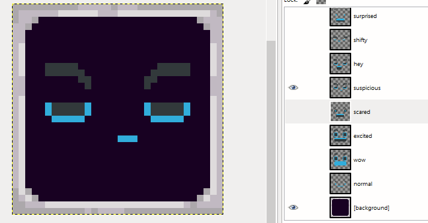

# GIMP Spritesheet Exporter plugin (Python-fu)
Export multiple layers from [GIMP](https://www.gimp.org/) to a spritesheet (png+json).

## Howto:
* Only visible layers will be exported
* File > Export Spritesheet
* Select output directory
* Spritesheet .png and .json metadata will be exported (filename same as GIMP file).
* All sprites need to be the same size
* Layers are output in reverse order

## Example input:



## Example output:


```json
{
      "frames": 6,
      "frame_width": 32,
      "frame_height": 32
}
```
